# PKI Signing Service

**Pure Rust code signing engine** — Authenticode for Windows PE/CAB/MSI, detached CMS/PKCS#7, PowerShell scripts, RFC 3161 timestamping.

No OpenSSL. No `signtool.exe`. No external dependencies. One binary.

**[Landing page](https://rayketcham-lab.github.io/PKI-Signing-Service/)** · **[Live demos (asciinema)](https://rayketcham-lab.github.io/PKI-Signing-Service/demo.html)** · **[Releases](https://github.com/rayketcham-lab/PKI-Signing-Service/releases)** · **[Changelog](CHANGELOG.md)**

<p align="center">
  <a href="https://rayketcham-lab.github.io/PKI-Signing-Service/demo.html">
    
  </a>
  <br>
  <em>▶ <a href="https://rayketcham-lab.github.io/PKI-Signing-Service/demo.html">Watch the full demo suite (6 scripted casts)</a></em>
</p>

---

### Project Health

<!-- CI / Testing Pipeline -->
[](https://github.com/rayketcham-lab/PKI-Signing-Service/actions/workflows/ci.yml)
[](https://github.com/rayketcham-lab/PKI-Signing-Service/actions/workflows/daily-health.yml)
[](https://github.com/rayketcham-lab/PKI-Signing-Service/actions/workflows/interop.yml)
[](https://github.com/rayketcham-lab/PKI-Signing-Service/actions/workflows/security-regression.yml)

<!-- Security & Compliance -->
[](https://rustsec.org/)
[](https://embarkstudios.github.io/cargo-deny/)
[](https://embarkstudios.github.io/cargo-deny/)
[](https://github.com/rayketcham-lab/PKI-Signing-Service)
[](https://github.com/rayketcham-lab/PKI-Signing-Service)

<!-- Project Info -->
[](https://github.com/rayketcham-lab/PKI-Signing-Service/releases/latest)
[](LICENSE)
[](https://www.rust-lang.org/)
[](https://blog.rust-lang.org/)

<!-- Build & Quality -->
[](https://github.com/rayketcham-lab/PKI-Signing-Service/actions/workflows/ci.yml)
[](https://github.com/rayketcham-lab/PKI-Signing-Service/actions/workflows/ci.yml)
[](https://github.com/rayketcham-lab/PKI-Signing-Service)
[](https://github.com/rayketcham-lab/PKI-Signing-Service/releases)
[](https://github.com/rayketcham-lab/PKI-Signing-Service/releases)

---

## Table of Contents

- [Features](#features)
- [Quick Start](#quick-start)
  - [Install](#install)
  - [Sign a file](#sign-a-file)
  - [Verify a signature](#verify-a-signature)
- [Web Service Mode](#web-service-mode)
  - [Configuration](#configuration)
  - [API Reference](#api-reference)
- [TSA Server](#tsa-server)
- [CLI Reference](#cli-reference)
- [Architecture](#architecture)
- [Security](#security)
- [Building from Source](#building-from-source)
- [Roadmap](#roadmap)
- [Contributing](#contributing)
- [Changelog](#changelog)
- [License](#license)

## Features

- **PE Authenticode signing** --- EXE, DLL, SYS, OCX, SCR, CPL, DRV
- **MSI/CAB signing** --- Windows Installer and Cabinet archives
- **Detached CMS/PKCS#7** --- Sign any file with a `.p7s` detached signature
- **PowerShell signing** --- PS1 scripts with Base64 PKCS#7 signature blocks
- **RFC 3161 timestamping** --- Counter-signatures for long-term validity
- **Multi-algorithm** --- RSA (2048-4096), ECDSA P-256/P-384/P-521, Ed25519. Post-quantum (ML-DSA-44/65/87) opt-in via `--features pq-experimental`.
- **Signature verification** --- Validate Authenticode and detached CMS signatures
- **PFX/PKCS#12 import** --- Load signing credentials from `.pfx` files
- **Web service mode** --- REST API for Code Signing as a Service
- **Built-in TSA server** --- RFC 3161 Time-Stamp Authority on port 3318
- **LDAP authentication** --- Header-based auth via reverse proxy
- **Certificate management** --- Admin API for hot-reload, listing, and rotation
- **Audit logging** --- Every signing operation logged with request ID, hash, client IP, and duration
- **Concurrency limit** --- Global ceiling on in-flight signing requests (`rate_limit_rps`, default 10) to bound CPU exhaustion
- **CIDR-aware reverse-proxy trust** --- Only whitelisted CIDRs may set `X-Forwarded-For` / `X-Real-IP`
- **Cosign-signed releases** --- Every release artifact ships with a self-contained `.cosign-bundle` (signature + certificate) for supply-chain verification
- **Static binary** --- `x86_64-unknown-linux-musl` target, zero runtime dependencies

> [!TIP]
> One binary handles CLI signing, a REST API server, and a standalone TSA server. Run it however you need it.

See the [interactive demos](https://rayketcham-lab.github.io/PKI-Signing-Service/demo.html) for six asciinema walkthroughs covering the CLI, API, auditor, and more.

## Quick Start

### Install

Download the latest release binary for your platform from the [releases page](https://github.com/rayketcham-lab/PKI-Signing-Service/releases/latest):

```bash
# Linux (glibc-linked, smaller)
curl -LO https://github.com/rayketcham-lab/PKI-Signing-Service/releases/latest/download/pki-sign-linux-x86_64
curl -LO https://github.com/rayketcham-lab/PKI-Signing-Service/releases/latest/download/pki-sign-linux-x86_64.sha256
sha256sum -c pki-sign-linux-x86_64.sha256
chmod +x pki-sign-linux-x86_64
sudo mv pki-sign-linux-x86_64 /usr/local/bin/pki-sign

# Linux (static musl — zero runtime dependencies, portable across distros)
curl -LO https://github.com/rayketcham-lab/PKI-Signing-Service/releases/latest/download/pki-sign-linux-x86_64-static
curl -LO https://github.com/rayketcham-lab/PKI-Signing-Service/releases/latest/download/pki-sign-linux-x86_64-static.sha256
sha256sum -c pki-sign-linux-x86_64-static.sha256
chmod +x pki-sign-linux-x86_64-static
sudo mv pki-sign-linux-x86_64-static /usr/local/bin/pki-sign
```

Windows: download [`pki-sign-windows-x86_64.exe`](https://github.com/rayketcham-lab/PKI-Signing-Service/releases/latest) and verify against the accompanying `.sha256`.

<details>
<summary><strong>Verify release signatures (cosign)</strong></summary>

Every release binary is signed with [cosign](https://github.com/sigstore/cosign) keyless signing. A self-contained `.cosign-bundle` (new bundle format — embeds the signature and Fulcio certificate) is uploaded next to each artifact.

```bash
# Download binary + cosign bundle
curl -LO https://github.com/rayketcham-lab/PKI-Signing-Service/releases/latest/download/pki-sign-linux-x86_64-static
curl -LO https://github.com/rayketcham-lab/PKI-Signing-Service/releases/latest/download/pki-sign-linux-x86_64-static.cosign-bundle

# Verify the binary was built + signed by our release workflow
cosign verify-blob pki-sign-linux-x86_64-static \
  --bundle pki-sign-linux-x86_64-static.cosign-bundle \
  --certificate-identity-regexp 'https://github.com/rayketcham-lab/PKI-Signing-Service/.*' \
  --certificate-oidc-issuer https://token.actions.githubusercontent.com
```

</details>

Or build from source:

```bash
cargo install --git https://github.com/rayketcham-lab/PKI-Signing-Service.git
```

### Sign a file

```bash
# Set the PFX password
export PKI_SIGN_PFX_PASSWORD="your-password"

# Sign a Windows executable (Authenticode)
pki-sign sign --pfx cert.pfx input.exe -o signed.exe

# Detached CMS signature (any file)
pki-sign sign-detached --pfx cert.pfx document.pdf -o document.p7s

# Skip timestamping (offline/testing)
pki-sign sign --pfx cert.pfx --no-timestamp input.dll -o signed.dll

# Custom TSA server
pki-sign sign --pfx cert.pfx --tsa http://timestamp.digicert.com input.exe
```

### Verify a signature

```bash
# Verify Authenticode signature
pki-sign verify signed.exe

# Verify with certificate details
pki-sign verify --verbose signed.exe

# Verify detached signature
pki-sign verify-detached --signature document.p7s document.pdf
```

Output:

```
Verifying: signed.exe
  Signature:   VALID
  Timestamped: true
  Signer:      CN=My Code Signing Cert, O=My Org
  Issuer:      CN=My Issuing CA
  Algorithm:   RSA-SHA256
  Digest:      SHA-256
  Content:     SPC_INDIRECT_DATA
```

---

## Web Service Mode

Run as a signing REST API. Upload files, get signed files back. HTTPS with TLS, LDAP auth, audit logging, certificate hot-reload.

```bash
# Start with config file
pki-sign serve --config /etc/pki/sign.toml

# Start with defaults (port 6447)
pki-sign serve

# Custom bind address
pki-sign serve --bind 127.0.0.1 --port 8443
```

### Configuration

```toml
# /etc/pki/sign.toml

bind_addr = "0.0.0.0"
bind_port = 6447
tls_cert = "/etc/pki/tls/server.pem"
tls_key = "/etc/pki/tls/server-key.pem"
max_upload_size = 524288000   # 500 MB
require_timestamp = true
audit_log = "/var/log/pki-sign/audit.log"
output_dir = "/var/lib/pki-sign/signed"

# Signing certificates (multiple supported)
[[cert_configs]]
name = "desktop"
pfx_path = "/etc/pki/certs/desktop.pfx"
pfx_password_env = "PFX_PASSWORD_DESKTOP"

[[cert_configs]]
name = "server"
pfx_path = "/etc/pki/certs/server.pfx"
pfx_password_env = "PFX_PASSWORD_SERVER"

# Timestamp Authority
[tsa]
urls = ["http://timestamp.digicert.com", "http://timestamp.comodoca.com"]
timeout_secs = 30

# Authentication
auth_mode = "header"  # none, header, mtls, apikey

[ldap]
enabled = true
user_header = "X-Remote-User"
groups_header = "X-Remote-Groups"
email_header = "X-Remote-Email"
admin_group = "CN=PKI Admins,OU=Groups,DC=corp,DC=example,DC=com"

[ldap.cert_groups]
desktop = "CN=Desktop Signers,OU=Groups,DC=corp,DC=example,DC=com"
server = "CN=Server Signers,OU=Groups,DC=corp,DC=example,DC=com"
```

### API Reference

#### Public endpoints

| Method | Path | Description |
|--------|------|-------------|
| `POST` | `/api/v1/sign` | Upload and sign a file (multipart) |
| `POST` | `/api/v1/sign-detached` | Create detached CMS signature |
| `POST` | `/api/v1/sign-batch` | Sign up to 10 files, return a ZIP + `signing_summary.csv` |
| `POST` | `/api/v1/verify` | Verify an Authenticode signature |
| `POST` | `/api/v1/verify-detached` | Verify a detached signature |
| `GET` | `/api/v1/status` | Server status and statistics |
| `GET` | `/api/v1/health` | Health check |
| `GET` | `/api/v1/certificate` | Public signing certificate info |
| `POST` | `/api/v1/report-issue` | Submit a user issue report |

#### Admin endpoints (bearer token or LDAP admin group)

| Method | Path | Description |
|--------|------|-------------|
| `GET` | `/admin/stats` | Detailed signing statistics |
| `GET` | `/admin/audit` | Recent audit log entries |
| `POST` | `/admin/reload` | Hot-reload PFX credentials |
| `GET` | `/admin/certs` | List all loaded certificates |
| `GET` | `/admin/certs/:name` | Detailed certificate info |
| `POST` | `/admin/certs/:name/default` | Set default signing certificate |

<details>
<summary><strong>Sign a file (curl)</strong></summary>

```bash
curl -X POST https://sign.example.com/api/v1/sign \
  -H "X-Remote-User: jdoe" \
  -F "file=@myapp.exe" \
  -o myapp-signed.exe

# Response headers include:
#   X-Request-Id: <uuid>
#   X-PKI-Sign-Hash: <sha256>
#   X-PKI-Sign-Algorithm: RSA-SHA256
#   X-PKI-Sign-Certificate: desktop
#   X-PKI-Sign-Timestamp: true
#   X-PKI-Sign-Duration-Ms: 342
```

</details>

<details>
<summary><strong>Batch sign (curl)</strong></summary>

```bash
# Upload up to 10 files in a single request; response is a ZIP archive
curl -X POST https://sign.example.com/api/v1/sign-batch \
  -H "X-Remote-User: jdoe" \
  -F "file=@app1.exe" \
  -F "file=@app2.dll" \
  -F "file=@installer.msi" \
  -F "cert_type=desktop" \
  -o signed-batch.zip

# The ZIP contains signed_<name> for each input plus signing_summary.csv
# with columns: file, status, algorithm, timestamped, duration_ms, error
unzip -l signed-batch.zip
```

</details>

<details>
<summary><strong>Detached signature (curl)</strong></summary>

```bash
# Binary response (default)
curl -X POST https://sign.example.com/api/v1/sign-detached \
  -H "X-Remote-User: jdoe" \
  -F "file=@document.pdf" \
  -o document.p7s

# JSON response
curl -X POST https://sign.example.com/api/v1/sign-detached \
  -H "X-Remote-User: jdoe" \
  -H "Accept: application/json" \
  -F "file=@document.pdf"
```

```json
{
  "request_id": "a1b2c3d4-...",
  "p7s": "<base64-encoded-signature>",
  "file_hash": "abcdef123456...",
  "p7s_hash": "789abc...",
  "timestamped": true,
  "certificate": "desktop",
  "duration_ms": 287
}
```

</details>

<details>
<summary><strong>Verify a file (curl)</strong></summary>

```bash
curl -X POST https://sign.example.com/api/v1/verify \
  -F "file=@signed.exe"
```

```json
{
  "request_id": "...",
  "signature_valid": true,
  "chain_valid": true,
  "timestamped": true,
  "signer_subject": "CN=My Code Signing Cert, O=My Org",
  "signer_issuer": "CN=My Issuing CA",
  "algorithm": "RSA-SHA256",
  "digest_algorithm": "SHA-256",
  "timestamp_time": "2026-03-12T14:30:00Z"
}
```

</details>

<details>
<summary><strong>Admin: hot-reload certificates (curl)</strong></summary>

```bash
curl -X POST https://sign.example.com/admin/reload \
  -H "Authorization: Bearer <admin-token>"
```

```json
{
  "status": "reloaded",
  "certificates_loaded": 2
}
```

</details>

---

## TSA Server

Standalone RFC 3161 Time-Stamp Authority server. IANA-assigned port 3318.

```bash
pki-sign tsa serve \
  --cert /etc/pki/tsa/tsa.pem \
  --key /etc/pki/tsa/tsa-key.pem \
  --policy-oid 1.3.6.1.4.1.56266.1.30.1 \
  --port 3318
```

Compatible with any RFC 3161 client --- `signtool.exe`, `openssl ts`, or this tool's own `--tsa` flag.

---

## CLI Reference

```
pki-sign 0.6.0
PKI Signing Service - Pure Rust Code Signing Engine

USAGE:
    pki-sign <COMMAND>

COMMANDS:
    serve            Start the web server for Code Signing as a Service
    sign             Sign a file using Authenticode
    sign-detached    Create a detached CMS/PKCS#7 signature (.p7s)
    verify           Verify an Authenticode signature
    verify-detached  Verify a detached CMS/PKCS#7 signature
    setup            Interactive setup wizard
    tsa              Time-Stamp Authority (RFC 3161) server commands
    help             Print help
```

| Flag | Command | Description |
|------|---------|-------------|
| `--pfx` | `sign`, `sign-detached` | Path to PFX/PKCS#12 certificate file |
| `--password-env` | `sign`, `sign-detached` | Env var with PFX password (default: `PKI_SIGN_PFX_PASSWORD`) |
| `--tsa` | `sign`, `sign-detached` | TSA URL for timestamping |
| `--no-timestamp` | `sign`, `sign-detached` | Skip timestamping |
| `-o, --output` | `sign`, `sign-detached` | Output file path |
| `--verbose` | `verify`, `verify-detached` | Show detailed certificate info |
| `--signature` | `verify-detached` | Path to `.p7s` signature file |
| `-c, --config` | `serve` | Config file path (default: `/etc/pki/sign.toml`) |
| `-p, --port` | `serve`, `tsa serve` | Bind port |
| `--bind` | `serve`, `tsa serve` | Bind address (default: `0.0.0.0`) |

---

## Architecture

```
                        ┌─────────────────────────────┐
                        │         pki-sign CLI         │
                        │  sign | verify | serve | tsa │
                        └──────────────┬──────────────┘
                                       │
              ┌────────────────────────┼────────────────────────┐
              │                        │                        │
     ┌────────▼────────┐    ┌─────────▼─────────┐    ┌────────▼────────┐
     │   Web Server     │    │      Signer        │    │   TSA Server    │
     │   (axum)         │    │   (orchestrator)    │    │  (RFC 3161)     │
     │                  │    │                     │    │  port 3318      │
     │  LDAP auth       │    │  PFX → key + cert   │    └─────────────────┘
     │  Audit logging   │    │  File type detect    │
     │  Cert mgmt API   │    │  Hash → Sign → Embed │
     │  GitHub issues   │    │                     │
     └──────────────────┘    └──────────┬──────────┘
                                        │
                    ┌───────────────────┼───────────────────┐
                    │                   │                   │
           ┌────────▼──────┐   ┌───────▼───────┐   ┌──────▼──────┐
           │  PE Parser     │   │  PKCS#7/CMS   │   │  Timestamper │
           │                │   │  Builder       │   │  (RFC 3161)  │
           │  Authenticode  │   │                │   │              │
           │  hash compute  │   │  SignedData    │   │  TSA client  │
           │  sig embed     │   │  DigestedData  │   │  failover    │
           │  cert table    │   │                │   └──────────────┘
           └────────────────┘   └────────────────┘
```

### Modules

| Module | Description |
|--------|-------------|
| `pe/` | PE/COFF parser, Authenticode hash, signature embedding |
| `cab` | Cabinet archive parser and Authenticode signer |
| `msi` | MSI compound-document parser and Authenticode signer |
| `pkcs7/` | CMS/PKCS#7 ASN.1 builder --- SignedData, DigestedData, ESS signed attributes |
| `signer` | Signing orchestrator --- PFX load, file type detection, pipeline coordination |
| `verifier` | Signature verification --- digest comparison, chain validation, EKU checking |
| `timestamp` | RFC 3161 TSA client with failover across multiple servers |
| `tsa_http` | Standalone TSA HTTP server |
| `tsa_server` | TSA token generation engine |
| `powershell` | PowerShell script signing with Base64 PKCS#7 blocks |
| `web/` | axum HTTP server, LDAP middleware, audit logging, admin API |
| `config` | TOML configuration with env var and CLI overrides |

---

## Security

- **No OpenSSL** --- Pure Rust crypto stack (`rsa`, `p256`, `p384`, `p521`, `ed25519-dalek`, `sha2`, `aes-gcm`; `ml-dsa` only with `--features pq-experimental`). TLS via `rustls` with `aws-lc-rs` backend.
- **OpenSSL banned** --- `cargo-deny` blocks `openssl`, `openssl-sys`, and `native-tls` crate usage.
- **Key zeroization** --- Private keys wrapped in `Zeroizing<>` for secure memory cleanup.
- **Audit trail** --- Every sign/verify operation logged with request ID, file hash, signer, client IP, timestamp status, and duration.
- **Auth modes** --- None (dev), LDAP header pass-through, mTLS, API key.
- **Security headers + CSP** --- Applied via middleware on all responses; fail-closed auth middleware.
- **Body-limit enforcement** --- Oversized uploads rejected with `413` before any bytes are buffered (Content-Length + chunked transfer-encoding both covered).
- **CSRF Origin guard** --- State-changing routes (`POST /api/v1/*`, `/admin/*`) reject browser requests whose `Origin` does not match the server's `Host` or the configured `trusted_origins` allowlist. Missing `Origin` (curl/scripts) is allowed.
- **Concurrency limiting** --- Global in-flight cap on signing endpoints via `rate_limit_rps`; CIDR-aware reverse-proxy trust for `X-Forwarded-For` / `X-Real-IP`.
- **Supply-chain signing** --- Release artifacts signed with cosign (keyless / GitHub OIDC). Regression test asserts a `.cosign-bundle` ships for every binary.
- **CI hardening** --- `cargo-audit` + `cargo-deny` on every push *and* the release gate. YAML lint on workflows + dependabot config. All GitHub Action versions pinned to commit SHAs.
- **Secret scanning** --- Pre-commit hook + CI gate block committed credentials.
- **Static binary** --- musl target for minimal attack surface in production.

> [!IMPORTANT]
> Always run with `auth_mode = "header"` or `"mtls"` in production. The default `"none"` mode is for development only.

---

## Building from Source

```bash
git clone https://github.com/rayketcham-lab/PKI-Signing-Service.git
cd PKI-Signing-Service
cargo build --release
```

The binary is at `target/release/pki-sign`.

### Static binary (musl)

```bash
rustup target add x86_64-unknown-linux-musl
cargo build --release --target x86_64-unknown-linux-musl
```

### Run checks

```bash
cargo test --workspace
cargo clippy --all-targets --workspace -- -D warnings
cargo fmt --all --check
```

### Run as systemd service

```ini
# /etc/systemd/system/pki-sign.service
[Unit]
Description=PKI Signing Service
After=network.target

[Service]
Type=simple
ExecStart=/usr/local/bin/pki-sign serve --config /etc/pki/sign.toml
Restart=on-failure
User=pki-sign
Group=pki-sign
EnvironmentFile=/etc/pki/sign.env

[Install]
WantedBy=multi-user.target
```

---

## Roadmap

The project is stable for Authenticode, detached CMS, and RFC 3161 signing workloads. Ongoing work is tracked in [GitHub issues](https://github.com/rayketcham-lab/PKI-Signing-Service/issues); the milestones below capture the directional bets.

### Recently shipped

- **Scope trim (v0.6.0)** --- removed CMS EnvelopedData (encryption: ECDH, ML-KEM, RSA-OAEP key transport) and RFC 4998 Evidence Record Syntax. This is a signing service, not a key-agreement / long-term-archive product. `sign-detached` (CMS SignedData) already covers the "wrap any file for transport + later verify" workflow. ~4.7k LOC and five supporting crates gone from the dep graph.
- **Feature-gate ML-DSA behind `pq-experimental`** ([#72](https://github.com/rayketcham-lab/PKI-Signing-Service/issues/72)) --- default builds drop the `ml-dsa` / `slh-dsa` dependencies entirely; post-quantum opt-in via `cargo build --features pq-experimental`. The `default_build_cargo_tree_omits_ml_dsa` test pins the invariant.
- **CSRF Origin guard** ([#19](https://github.com/rayketcham-lab/PKI-Signing-Service/issues/19)) --- state-changing routes now reject cross-origin browser POSTs; `trusted_origins` allowlist with same-origin fallback.
- **Supply-chain regression floor** --- Cargo.lock-parsed tests pin `rustls-webpki ≥ 0.103.12`, `rustls ≥ 0.23.37`, `ring ≥ 0.17.14`; cosign guard-loop regression test catches silent unsigned-asset ships.

### v0.7 --- Structural clean-up

- **Decompose `signer.rs` / `verifier.rs` monoliths** ([#55](https://github.com/rayketcham-lab/PKI-Signing-Service/issues/55)) --- extract PFX loading and cert-validation helpers into dedicated modules without public-API churn.

### v0.8 --- Hybrid / composite certificates

- **Dual-sign PKCS#7** ([#22](https://github.com/rayketcham-lab/PKI-Signing-Service/issues/22) phase 2) --- same PKCS#7 envelope carries an RSA or ECDSA signature *and* an ML-DSA counter-signature, so a downstream verifier with either capability can validate.
- **Composite signatures (NIST SP 800-227)** ([#22](https://github.com/rayketcham-lab/PKI-Signing-Service/issues/22) phase 3) --- single certificate carrying both a classical and a PQ key; tracks the NIST composite-signature spec as it finalizes.

### v1.0 --- Production freeze

- Stable REST API surface with semver guarantees on `/api/v1/*`
- CAB/MSI Authenticode interop parity with `osslsigncode` / `signtool` (base parity landed in v0.5.7; continued hardening tracked via new issues as they surface)
- SLSA provenance attestations alongside the existing cosign signatures
- Documented HSM / KMS key-backend interfaces (no private-key-on-disk requirement)

Want to pull something forward? File an issue with the `roadmap` label or comment on an existing one.

## Contributing

Issues and PRs welcome. See [SECURITY.md](SECURITY.md) for vulnerability reports (please don't file those as public issues).

- **Triage labels**: `security` (highest priority), `bug`, `enhancement`, `testing`, `documentation`, `future`
- **Before opening a PR**: `cargo fmt --all --check`, `cargo clippy --all-targets --workspace -- -D warnings`, `cargo test --workspace` must all pass
- **Conventional commits**: prefixes `feat:`, `fix:`, `refactor:`, `test:`, `docs:`, `ci:`, `security:`
- **Good-first-issue candidates**: browse [open issues labeled `documentation` or `testing`](https://github.com/rayketcham-lab/PKI-Signing-Service/issues?q=is%3Aopen+label%3Adocumentation%2Ctesting)

## Changelog

See [CHANGELOG.md](CHANGELOG.md) for release history. Vulnerability reports: [SECURITY.md](SECURITY.md).

## License

Apache-2.0. See [LICENSE](LICENSE) and [NOTICE](NOTICE).
